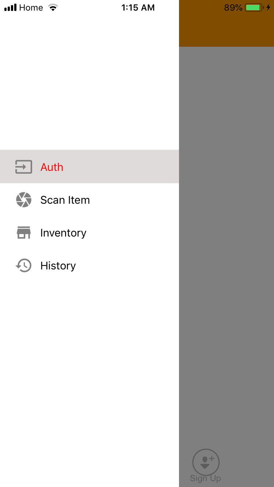
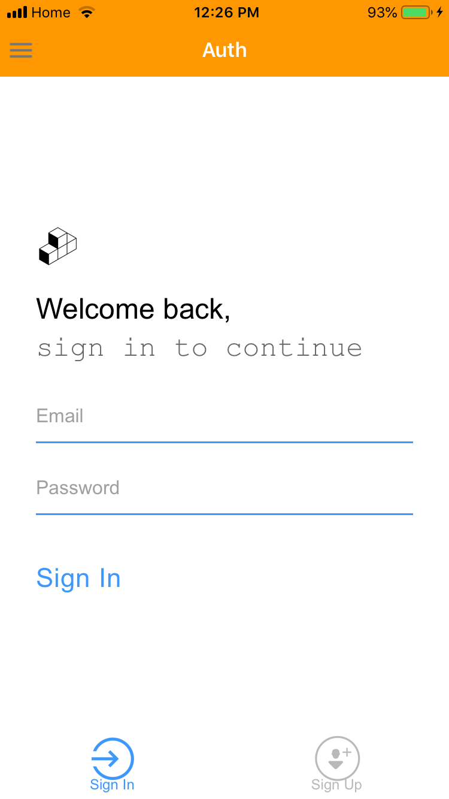
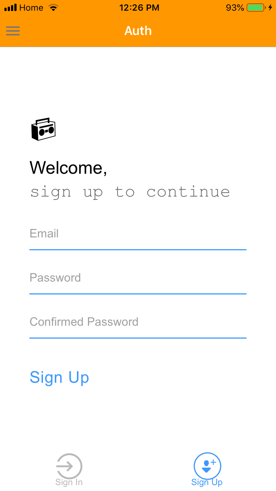
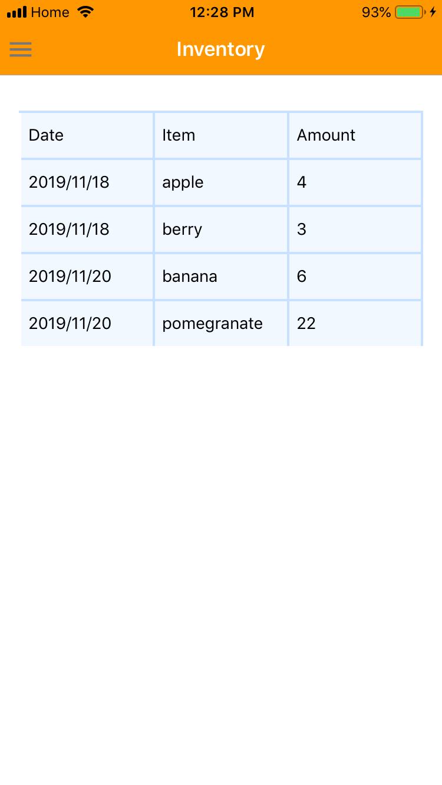
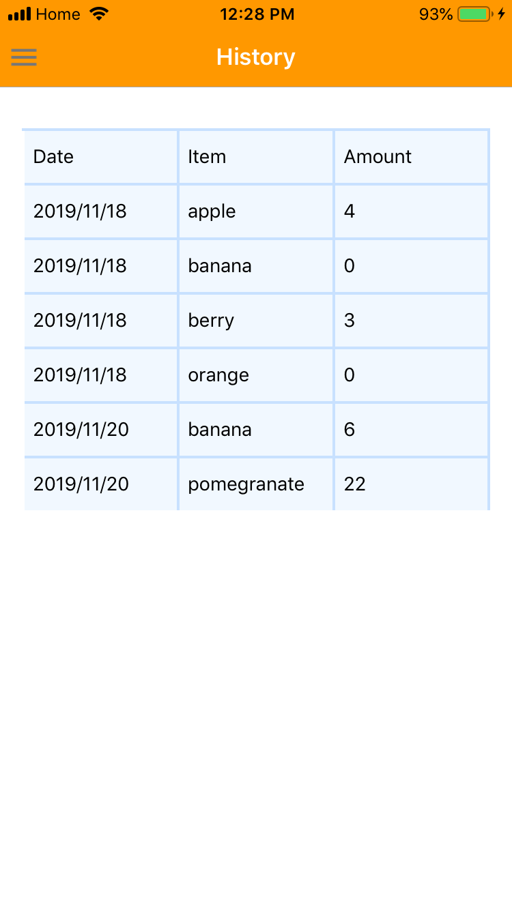
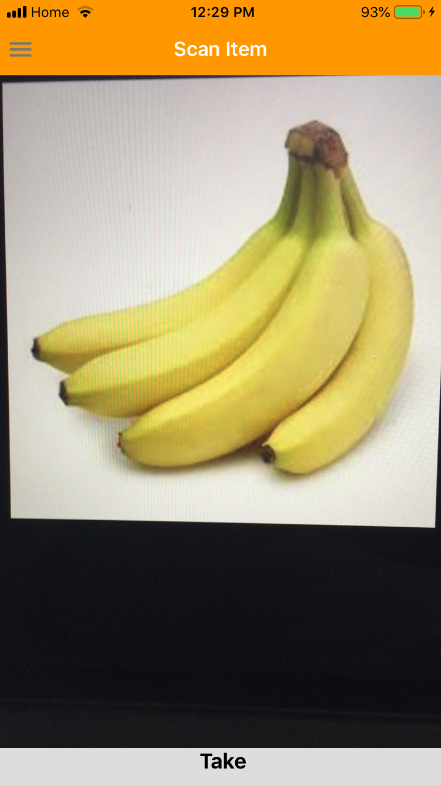
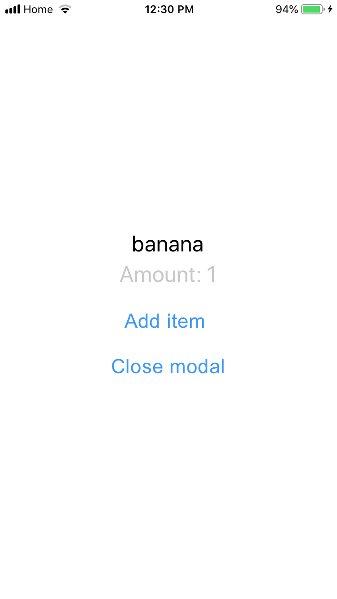

> Mobile Application for Managing Grocery Using React Native and TensorFlow Image Recognition

------------------------------

## Introduction

This project utilized image recognition to streamline accounting of purchased foods into a grocery management system.  It also tracked food items that were consumed or otherwise removed from the refrigerator or pantry.  Together, these are the two main functions that make up a grocery management platform that will help people know what foods they have at home and plan their grocery shopping such that it minimizes food waste. 

## Installation
1.  Download the repository
2.  Install Expo CLI by using this command line:

      npm install expo-cli --global
      
      
      
*  <strong> User App/Appliance Simulated App </strong>

3.  Change directory to the User-App/Appliance repository
4.  Then Run the following command lines:

      yarn
      expo start
     
5.  Scan the the QR Code using Expo Client app on your Smart phone

*  <strong> Server </strong>

6.  Run MySQL server from your machine 
7.  Change directory to the Server repository
8.  Run the server by using this command line:

      nodemon index.js
      

## User Interface

* <strong>Menu</strong>

* <strong>Sign In/Sign Up</strong>

           

* <strong>Inventory</strong>

* <strong> History </strong>

* <strong>Scan Item</strong>

             

